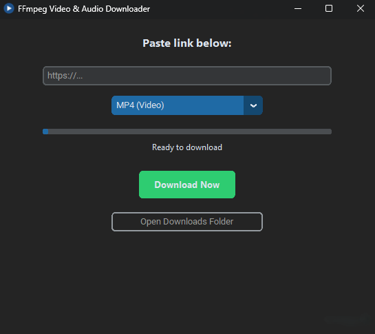

# 🎬 FFmpeg Video Audio Downloader
A powerful, standalone GUI-based media downloader powered by `yt-dlp` and `FFmpeg`. Designed for high-quality video archiving with full subtitle support, as well as high-quality audio extraction.

## ✨ Key Features
* **Dark Mode UI:** A clean, modern interface built with CustomTkinter.
* **Flexible Audio & Video Formats:** 
  * **MP4 Video:** Full quality with auto-merged streams.
  * **M4A Audio:** Direct, native AAC audio stream extraction
  * **MP3 Audio:** High-quality 320kbps conversion via FFmpeg.
  * **Opus Audio:** Direct raw WebM stream extraction.
* **Advanced Subtitles:** Automatically embeds subtitles into MP4 files and generates a separate `.srt` file for external use.
* **Wide Support:** Powered by `yt-dlp`, supporting 1,000+ sites (YouTube, DRTV, ARTE, Vimeo, Soundcloud, etc.).
* **Portable:** No Python installation required. Just download and run!

## ⚖️ Comparison: Standalone vs. Extensions

| Feature | Browser Extensions | FFmpeg Video & Audio Downloader |
| :--- | :--- | :--- |
| **Privacy** | Can track browsing history | **100% Private / Local** |
| **FFmpeg Processing** | Usually requires extra install | **Fully Bundled** |
| **Audio Extraction** | Often paywalled or low bitrate | **Native AAC & 320k MP3** |
| **Subtitle Files** | Often hardcoded or ignored | **Embedded + Separate .srt** |
| **Speed/Limits** | Often restricted for free users | **Unlimited & Free** |
| **Site Support** | Varies by extension | **1000+ Sites (yt-dlp)** |

## 📦 Installation & Usage
1. Go to the [Latest Release](https://github.com/airdenmark/FFmpeg-Video-Audio-Downloader/releases/latest).
2. Download the `.zip` file (e.g., `FFmpeg.Video.Audio.Downloader.v1.x.x.zip`).
3. Extract the contents to a folder of your choice.
4. **Pro Tip:** Right-click the `.exe` file, select **Properties**, check the **Unblock** box at the bottom, and click **OK**. This prevents Windows from asking for permission every time you run the app.
5. Run the `.exe` file, select your desired video/audio format, paste a link, and start downloading!

> [!IMPORTANT]
> **Note on Windows SmartScreen:**
> Because this is a new, independent application, Windows may show a warning. If you haven't "unblocked" the file as described above, click **"More info"** and then **"Run anyway"**.

## ⚙️ Technical Specifications & Core Components
This application is compiled using the latest stable libraries to ensure maximum compatibility and speed.

| Component | Version | Link |
| :--- | :--- | :--- |
| **yt-dlp** | 2026.08.19 | [View Project](https://github.com/yt-dlp/yt-dlp) |
| **FFmpeg** | 2026-08-30-git-818cecc6e1 | [gyan.dev Builds](https://www.gyan.dev/ffmpeg/builds/) |
| **Python** | 3.13 | [View Project](https://www.python.org/) |
| **CustomTkinter** | v6.0.0 | [View Project](https://github.com/TomSchimansky/CustomTkinter) |
